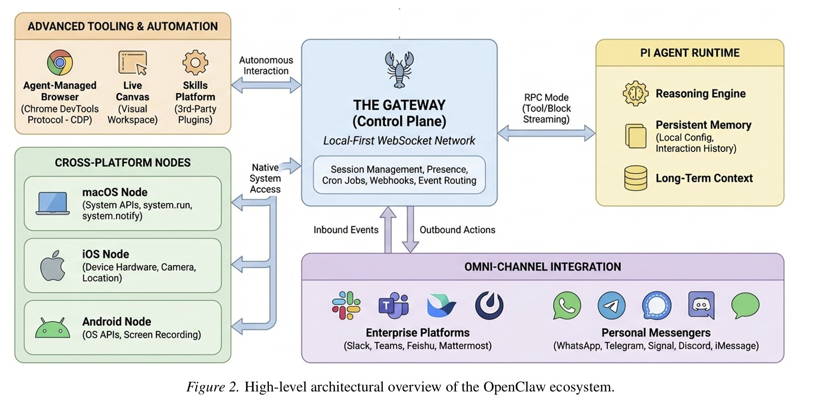
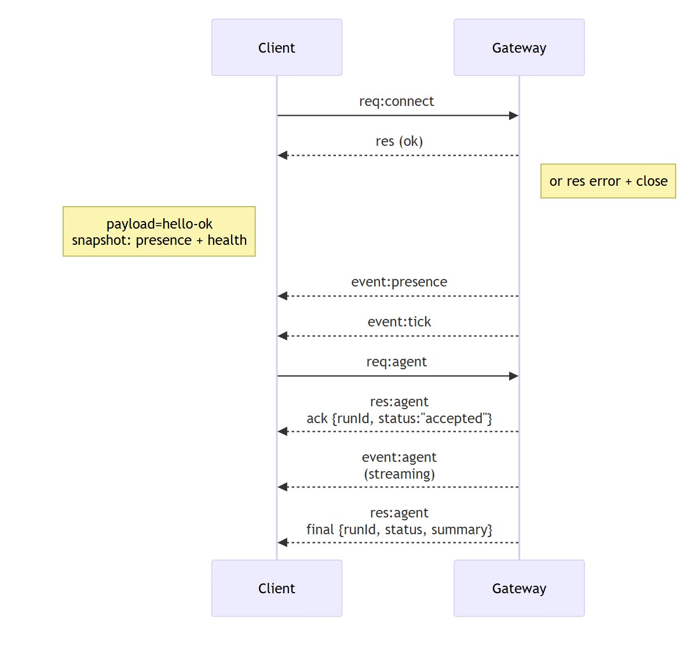

# OpenClaw 

## 1. High-level architecture

The central component is the **Gateway**—a daemon that runs locally on the host machine (default `127.0.0.1:18789`). It is the only component that maintains connections to messaging providers (WhatsApp via Baileys, Telegram via grammY, Slack, Discord, Signal, iMessage). All other actors connect to it via WebSockets. There is exactly one Gateway per host.

### Example flow
User write on WhatsApp
        ↓
WhatsApp → Gateway (via Baileys)
        ↓
Gateway elaborates, run agent loop
        ↓
PI Agent Runtime (LLM elaborate, execute tool)
        ↓
Gateway responds on WhatsApp

### Actors

**Gateway (daemon)**
Controls the entire system. It validates every incoming frame against JSON Schema, routes messages to sessions, manages cron jobs, webhooks, and presence. It exposes both a WebSocket API and an HTTP server on the same port (canvas host under `/__openclaw__/canvas/`).

**Client** (mac app, CLI, web admin, automations)
Control plane interfaces used by the operator. Each client opens a single
WebSocket connection, sends requests (health, status, send, agent,
system-presence), and subscribes to server-push events (tick, agent, presence,
shutdown).The Mac app or CLI are the clients that connect to it.

**Node** (macOS, iOS, Android, headless)
Operating devices that connect with `role: node` and expose concrete hardware commands: `canvas.*`, `camera.*`, `screen.record`, `location.get`. The agent can invoke these commands remotely via `node.invoke`.

**PI Agent Runtime**
The main reasoning engine, separate from the Gateway. Communicates via RPC(Remote Procedure Call) with tool and block streaming. Maintains persistent memory (local config, interaction history, long-term context).

**Reasons** — takes the system prompt + conversation history and calls the LLM
**Decides which tools to use** — interprets the LLM's response and determines whether it should execute a tool (open the browser, read a file, execute a shell command)
**Executes the tools** — calls the tool, takes the result, and sends it back to the LLM
**Iterates** — this is the loop: LLM → tool → result → LLM → tool → ... until the agent has a final response
**Streams** — while it works, sends deltas in real time to the Gateway, which forwards them to the client

**Integration omni-channel**
Over 20 messaging channels — enterprise (Slack, Teams, Feishu, Mattermost) and personal (WhatsApp, Telegram, Signal, Discord, iMessage). The Gateway is the universal inbox/outbox.



## 2. Connession protocol and authentication

### Transport Protocol

Transport: WebSocket, text frames with JSON payload.

In the same WebSocket connection, exist three types of frames:
- **`connect`** — open the session (must be always the first frame, otherwise hard close)
- **`req/res`** — synchronous call: `{type:"req", id, method, params}` → `{type:"res", id, ok, payload|error}`
- **`event`** — server-push async: `{type:"event", event, payload, seq?, stateVersion?}`

The methods with side effects (`send`, `agent`) require an **idempotency key** to safely handle retries. Events are **never retransmitted**—a reconnecting client must actively update its state.

### Authentication 

**Livello 1 — Gateway auth** (applied to all connections, local and remote):
Each connection must pass an access check — either via shared-secret (token or password in the `connect` frame), via identity header (Tailscale/trusted-proxy), or disabled completely (`mode: "none"`, only on private ingress).
**Livello 2 — Device pairing:**
Each client signs a challenge nonce with its device identity; new devices require manual approval (except local loopback), after which the Gateway issues a device token for subsequent reconnections.
**Important:** 
The `v3` signature also binds `platform` and `deviceFamily` — changing this metadata invalidates the existing pairing and requires new approval.
### Lifecycle connection

```
1. Client sends req:connect (first frame — hard close if not connect)
2. Gateway validates: JSON Schema + auth + pairing
      └─ if invalid → res:error + connection closed
3. Gateway responds with hello-ok
      └─ payload: presence snapshot + health snapshot + device token
4. Gateway pushes autonomous events → event:presence, event:tick (every 15s)
5. Client sends operative requests → req:agent, req:send, req:status ...
6. For req:agent:
      ├─ immediate ack: res:agent {runId, status:"accepted"}
      ├─ streaming events: event:agent (assistant deltas, tool updates)
      └─ final response: res:agent {runId, status, summary}
```

