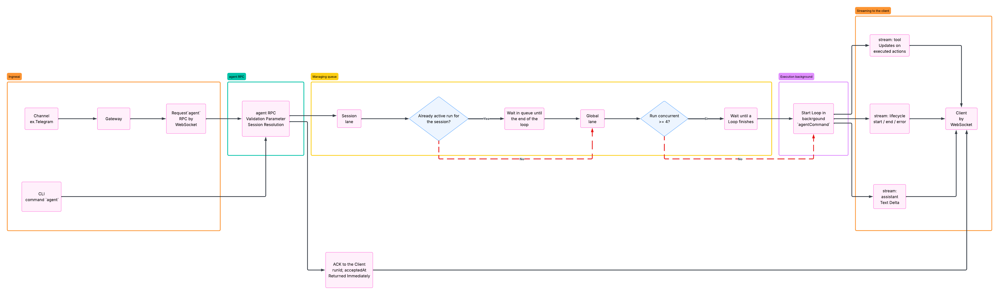
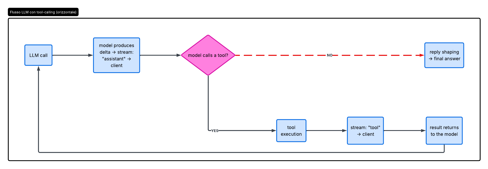

# OpenClaw

## Table of Contents

- [OpenClaw](#openclaw)
  - [Table of Contents](#table-of-contents)
  - [1. High-level architecture](#1-high-level-architecture)
    - [Example flow](#example-flow)
    - [Actors](#actors)
  - [2. Connection protocol and authentication](#2-connection-protocol-and-authentication)
    - [Transport Protocol](#transport-protocol)
    - [Authentication](#authentication)
    - [Lifecycle connection](#lifecycle-connection)
  - [3. Agent Loop](#3-agent-loop)
    - [Entry point](#entry-point)
    - [Phase 1 — Startup and Queues](#phase-1--startup-and-queues)
      - [1.1 agent RPC (Intake)](#11-agent-rpc-intake)
      - [1.2 Session Lane](#12-session-lane)
      - [1.3 Channel queuing modes](#13-channel-queuing-modes)
      - [1.4 agent.wait (optional)](#14-agentwait-optional)
    - [Phase 2 — In the Loop](#phase-2--in-the-loop)
      - [2.1 agentCommand](#21-agentcommand)
      - [2.2 Context preparation](#22-context-preparation)
      - [2.3 Prompt assembly](#23-prompt-assembly)
      - [2.4 The iterative cycle (heart of the loop)](#24-the-iterative-cycle-heart-of-the-loop)
      - [2.5 runEmbeddedPiAgent](#25-runembeddedpiagent)
      - [2.6 subscribeEmbeddedPiSession](#26-subscribeembeddedpisession)
    - [Phase 3 — Output](#phase-3--output)
      - [3.1 Tool execution](#31-tool-execution)
      - [3.2 Reply shaping](#32-reply-shaping)
      - [3.3 Compaction](#33-compaction)
      - [3.4 Timeout levels](#34-timeout-levels)
      - [3.5 Early termination](#35-early-termination)
---

## 1. High-level architecture

The central component is the **Gateway** — a daemon that runs locally on the host machine (default `127.0.0.1:18789`). It is the only component that maintains connections to messaging providers (WhatsApp via Baileys, Telegram via grammY, Slack, Discord, Signal, iMessage). All other actors connect to it via WebSocket. There is exactly one Gateway per host.

### Example flow

```
User writes on WhatsApp
        ↓
WhatsApp → Gateway (via Baileys)
        ↓
Gateway elaborates, runs agent loop
        ↓
PI Agent Runtime (LLM elaborates, executes tools)
        ↓
Gateway responds on WhatsApp
```

### Actors

**Gateway (daemon)**
Controls the entire system. Validates every incoming frame against JSON Schema, routes messages to sessions, manages cron jobs, webhooks, and presence. Exposes both a WebSocket API and an HTTP server on the same port (canvas host under `/__openclaw__/canvas/`).

**Client** (mac app, CLI, web admin, automations)
Control plane interfaces used by the operator. Each client opens a single WebSocket connection, sends requests (`health`, `status`, `send`, `agent`, `system-presence`), and subscribes to server-push events (`tick`, `agent`, `presence`, `shutdown`). The mac app or CLI are the clients that connect to the Gateway.

**Node** (macOS, iOS, Android, headless)
Operating devices that connect with `role: node` and expose concrete hardware commands: `canvas.*`, `camera.*`, `screen.record`, `location.get`. The agent can invoke these commands remotely via `node.invoke`.

**PI Agent Runtime**
The main reasoning engine, separate from the Gateway. Communicates via RPC (Remote Procedure Call) with tool and block streaming. Maintains persistent memory (local config, interaction history, long-term context).

- **Reasons** — takes the system prompt + conversation history and calls the LLM
- **Decides which tools to use** — interprets the LLM response and determines whether to execute a tool (browser, file, shell command)
- **Executes the tools** — calls the tool, takes the result, and sends it back to the LLM
- **Iterates** — this is the loop: LLM → tool → result → LLM → tool → ... until the agent has a final response
- **Streams** — while working, sends deltas in real time to the Gateway, which forwards them to the client

**Omni-channel integration**
Over 20 messaging channels — enterprise (Slack, Teams, Feishu, Mattermost) and personal (WhatsApp, Telegram, Signal, Discord, iMessage). The Gateway is the universal inbox and outbox.


---

## 2. Connection protocol and authentication

### Transport Protocol

Transport: WebSocket, text frames with JSON payload.

Three frame types coexist on the same connection:

- **`connect`** — opens the session. Must always be the first frame, otherwise hard close.
- **`req/res`** — synchronous call: `{type:"req", id, method, params}` → `{type:"res", id, ok, payload|error}`
- **`event`** — server-push async: `{type:"event", event, payload, seq?, stateVersion?}`

Methods with side effects (`send`, `agent`) require an **idempotency key** to safely handle retries. Events are **never retransmitted** — a reconnecting client must actively refresh its state.

### Authentication

**Level 1 — Gateway auth** (applied to all connections, local and remote):
Each connection must pass an access check — either via shared-secret (token or password in the `connect` frame), via identity header (Tailscale/trusted-proxy), or disabled completely (`mode: "none"`, only on private ingress).

**Level 2 — Device pairing:**
Each client signs a challenge nonce with its device identity. New devices require manual approval (except local loopback), after which the Gateway issues a device token for subsequent reconnections.

> **Important:** The `v3` signature also binds `platform` and `deviceFamily` — changing this metadata invalidates the existing pairing and requires new approval.

### Lifecycle connection

```
1. Client sends req:connect (first frame — hard close if not connect)
2. Gateway validates: JSON Schema + auth + pairing
      └─ if invalid → res:error + connection closed
3. Gateway responds with hello-ok
      └─ payload: presence snapshot + health snapshot + device token
4. Gateway pushes autonomous events → event:presence, event:tick (every 15s)
5. Client sends operative requests → req:agent, req:send, req:status ...
6. For req:agent:
      ├─ immediate ack: res:agent {runId, status:"accepted"}
      ├─ streaming events: event:agent (assistant deltas, tool updates)
      └─ final response: res:agent {runId, status, summary}
```


---

## 3. Agent Loop

The Agent Loop is the complete and real execution of an agent: **intake → context assembly → model inference → tool execution → streaming replies → persistence.**

It is not a single call to the LLM. It is a repeating cycle: the model thinks, decides to use a tool, executes it, the result returns to the model, the model thinks again — until it produces a final answer without calling any other tools.

A loop = one serialized run per session. Two loops can never run simultaneously on the same session.

### Entry point

- **Gateway RPC**: `agent` method (fire-and-forget) or `agent.wait` (waits for completion)
- **CLI**: `agent` command

---

### Phase 1 — Startup and Queues



#### 1.1 agent RPC (Intake)

Validates parameters, resolves the session (`sessionKey` / `sessionId`), persists metadata. Returns **immediately** `{runId, acceptedAt}` — the loop has not yet started. The client only has a receipt. The job starts in the background.

#### 1.2 Session Lane

Before executing, the run must pass two queue levels:

**Session Lane** — max 1 active run per `sessionKey`. If the session already has an active run, the new request waits in queue. This ensures that history and tools are not touched by two simultaneous runs.

**Global Lane** — max 4 total concurrent runs on the process (default, configurable via `agents.defaults.maxConcurrent`). If the server is already at capacity, the run is parked until a slot becomes available.

#### 1.3 Channel queuing modes

Messaging channels choose how to handle incoming messages while a run is active:

| Mode | Behavior |
|---|---|
| `collect` | coalesces all messages into a single followup turn (default) |
| `steer` | injects the message into the current run |
| `followup` | queues for the next turn |
| `steer-backlog` | steer now + preserve for followup |

#### 1.4 agent.wait (optional)

`agent.wait` is not an alternate entry point — it is a listener that waits for a running loop to finish.

Returns `{status: ok|error|timeout, startedAt, endedAt, error?}`.

> **Critical:** If `agent.wait` times out (default 30s), it returns `{status: timeout}` but **does not stop the loop**. The loop continues running in the background. Stopping it requires an explicit AbortSignal or the runtime timeout.

---

### Phase 2 — In the Loop

#### 2.1 agentCommand

Resolves model and defaults, loads skills, calls `runEmbeddedPiAgent`. If the internal engine crashes silently, it emits the end event itself — the client never waits indefinitely.

#### 2.2 Context preparation

- Workspace resolved and created (sandboxed → `~/.openclaw/sandboxes`)
- Skills loaded and injected into the prompt
- Bootstrap files (`AGENTS.md`, `SOUL.md`, `MEMORY.md`…) injected into the system prompt
- **Session write lock** acquired — no other process writes to the session during the run

#### 2.3 Prompt assembly

System prompt constructed from: base prompt + skills prompt + bootstrap context + per-run overrides. Model token limits and reserve tokens for compaction are applied.

#### 2.4 The iterative cycle (heart of the loop)

The model calls the LLM, streams deltas to the client, and decides whether to use a tool. If yes, it executes the tool, the result returns to the model, and the cycle begins again. If no, the loop moves to reply shaping.



#### 2.5 runEmbeddedPiAgent

Manages queue entry, builds the PI session, streams events, imposes a timeout via AbortSignal, and returns the payload and consumed tokens.

#### 2.6 subscribeEmbeddedPiSession

Translates PI events into OpenClaw streams:

| PI Event | Stream |
|---|---|
| text delta | `stream: "assistant"` |
| tool events | `stream: "tool"` |
| lifecycle | `stream: "lifecycle"` (start \| end \| error) |

---

### Phase 3 — Output

#### 3.1 Tool execution

During the execution of each tool:
- `stream: "tool"` events (start, update, end) are emitted in real time to the client
- results are sanitized for size and image payload before being logged
- messaging tools already sent are tracked to avoid duplicate responses from the assistant

#### 3.2 Reply shaping

Before sending the final response, the payload is assembled and filtered:
- assistant text + optional reasoning
- inline tool summary (if verbose is enabled)
- the `NO_REPLY` / `no_reply` token is silently removed
- duplicates from messaging tools are eliminated
- if nothing renderable remains but a tool returned an error → a fallback error reply is emitted

#### 3.3 Compaction

If the context window fills during the loop:
- a `compaction` event is emitted on the stream
- can trigger a loop **retry**
- upon retry, in-memory buffers and tool summaries are cleared to avoid duplicate output

#### 3.4 Timeout levels

| Timeout | Config key | Default | Behavior |
|---|---|---|---|
| `agent.wait` | `timeoutMs` param | 30s | Caller stops waiting. Loop continues. |
| Agent runtime | `agents.defaults.timeoutSeconds` | 172800s (48h) | Aborts the entire loop via AbortSignal. |
| LLM idle | `agents.defaults.llm.idleTimeoutSeconds` | 120s | Aborts if no chunk arrives from the model. Set to 0 to disable. |

#### 3.5 Early termination

The loop can end before completion in four cases:
- Agent runtime timeout (AbortSignal)
- Explicit cancel (AbortSignal from client)
- Gateway disconnect or RPC timeout
- `agent.wait` timeout — stops the wait only, the loop keeps running